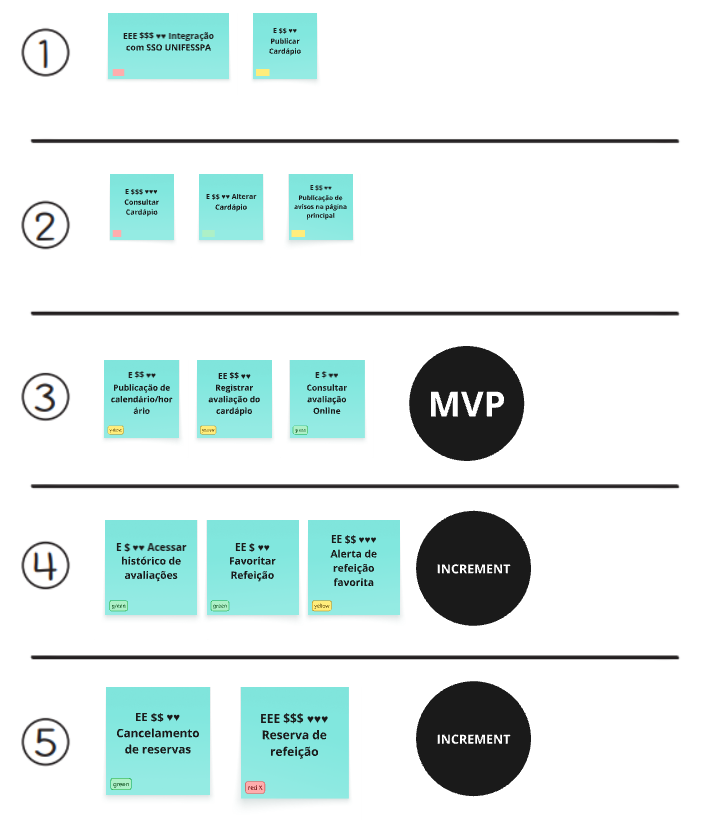
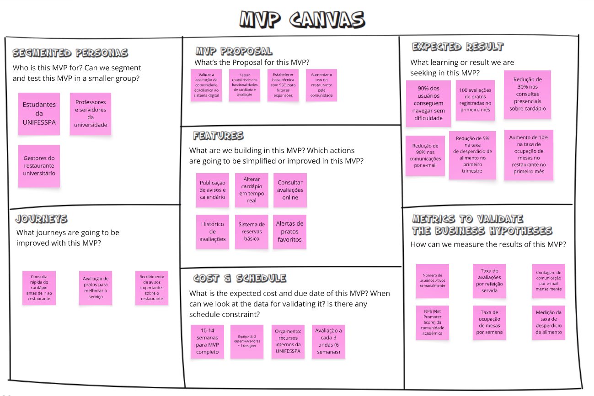
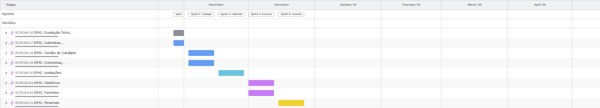

# Le Menu — Restaurante Universitário (UNIFESSPA)

Para a comunidade acadêmica da UNIFESSPA que precisa de acesso prático às informações do restaurante, o Le Menu é uma plataforma web que facilita a consulta do cardápio, a comunicação e o feedback. Diferentemente de processos manuais, o sistema centraliza todas as informações em um único local, acessível 24/7.

* Le Menu é um sistema de gestão para o Restaurante Universitário da UNIFESSPA.
O projeto visa simplificar a gestão do RU, permitindo que gestores publiquem cardápios, gerenciem reservas, avaliem refeições e se comuniquem com a comunidade acadêmica por meio de avisos e notificações.
Para usuários, o sistema permite visualizar o cardápio, fazer reservas, avaliar refeições, favoritar pratos e receber notificações sobre pratos favoritos e avisos.

# Links úteis (Entrega) 
* [Protótipo no Figma](https://www.figma.com/files/team/908433374743357625/project/460809153/Le-Menu?fuid=908433372225261412)
* [Miro MVP Canvas](https://miro.com/welcomeonboard/OS9SU28vK3lMSFIwVndSVWFZRDZ1WGdEd3NsQlBYSkZnZzBCbUo5VzdoRWJTR0QyVk5wK1dsL1JnaUFibW9UTlVEeWpPUU5QVVpFdDNqQTFYTnhUcVdVZlFUZk4zVklLWGxiR1NBZnEvazJXL0Yvb09NRnRaSEFxcEh1TzBkNFlBS2NFMDFkcUNFSnM0d3FEN050ekl3PT0hdjE=?share_link_id=145712470062)
* [Apresentação](https://www.youtube.com/watch?v=eMsNWXnWvQM)
# Sequenciador

# MVP Canvas

# Cronograma

# Páginas HTML

* [Index](wireframes/html-pages/index.html)
* [Consulta de Cardápio](wireframes/html-pages/lemenu-consulta-cardapio.html)
* [Cadastro de Cardápio](wireframes/html-pages/lemenu-cadastro-cardapio.html)
* [Avaliar Refeição](wireframes/html-pages/lemenu-avaliar-refeicao.html)
* [Consultar Avaliações](wireframes/html-pages/lemenu-consultar-avaliacoes.html)
* [Gestão de Avisos](wireframes/html-pages/lemenu-gestao-avisos.html)
